# An Introduction To MongoDB

## Introduction

Next up, after [GitHub](https://github.com/geersch/GettingStartedWithGitHub) and [Bootstrap](https://github.com/geersch/TwitterBootstrap), in the session I presented last month during a company trip, is [MongoDB](http://www.mongodb.org/).

MongoDB is a NoSQL database, instead of storing data in tables, it stores structured data in JSON-like documents, also known as BSON (Binary JSON).

This article isn't about NoSQL, it just shows you how you can quickly set up MongoDB and work with it in a .NET environment. Let's walk through the necessary steps to get MongoDB up and running.

## Installation

Once you've downloaded [MongoDB](http://www.mongodb.org/downloads) for Windows (32 or 64-bit), extract the archive to C:\\mongodb (or another drive / directory).

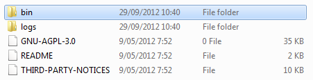

Notice the bin subdirectory. MongoDB is self-contained and does not have any other system dependencies. You can run it from any folder you choose.

MongoDB requires a data folder to store its files. Start a Command Prompt and execute the following commands:

```sh
cd \
md data
md data\db
```

You can place the new data directory on any drive (or in any subdirectory) you want. To start MongoDB, execute the following command from the Command Prompt:

```
c:\mongodb\bin\mongod.exe
```

## Run as Windows Service

Using this setup you have to manually start MongoDB each time you reboot your PC. This is a bit inconvenient, but it works. If you don't want to do this, then you can run MongoDB as a Windows Service. This way it will automatically be started on each reboot.

Open a Command Prompt (Run as Administrator) and execute the following commands:

```
md c:\mongodb\log
echo logpath=c:\mongodb\log\mongo.log > c:\mongodb\mongod.cfg
c:\mongodb\bin\mongod.exe --config c:\mongodb\mongod.cfg --install
net start MongoDB
```

First you create a new folder inside the mongodb folder called "log". The second command creates a MongoDB configuration file and instructs it to store its log files inside the newly created folder. Next you install MongoDB as a Windows service. Last, but not least you start the service.

If you now open the Services app, you should see the Mongo DB service listed.

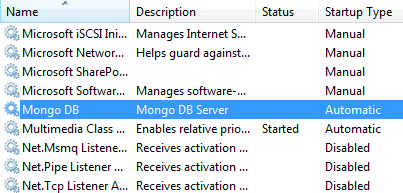

Be sure to check that the startup type is set to Automatic. If not, open the service's properties and change it.

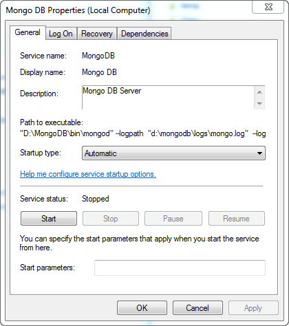

## MongoVUE

There are a couple of tools out there that allow you to manage MongoDB. Personally I prefer [MongoVUE](http://www.mongovue.com/). It is an easy to use desktop application for Windows. There is a paying version (35$) and a free version. The free one has fewer features, but for our purpose it more than suffices. Go ahead and [download](http://www.mongovue.com/downloads/) it.

**Remark**: During the installation process be sure to allow the Windows Firewall exception.

When you start MongoVUE it shows you a list of available connections.

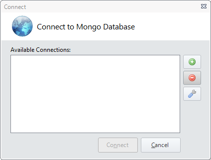

We need to add one for our localhost development environment. Click the + button and enter the following data:

- **Name**: localhost
- **Server**: localhost
- **Port**: 27017

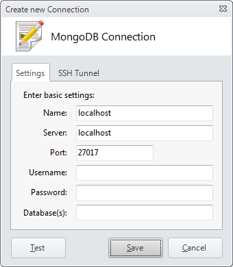

After you've established a connection you can use the Database Explorer in the lefthand pane to navigate through your MongoDB databases. By default you'll only see one database called local which doesn't contain any collection (sort of like tables in a RDBMS).

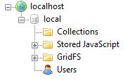

No need to create them manually, let's write some code to do that.

## MongoDB C# Driver

Start Visual Studio and create a new blank solution called MongoDB. Next add a Console Application "Timesheets" to it. Your solution structure should resemble the following screenshot:

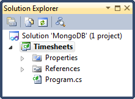

In order to work with MongoDB in .NET you can use the [MongoDB C# driver](http://nuget.org/packages/mongocsharpdriver) developed by the creators of MongoDB ([10gen](http://www.10gen.com/)). The driver is available as a NuGet package. At the time of writing it is at version 1.6.

Go ahead and install the NuGet package.

```sh
PM> Install-Package mongocsharpdriver
```

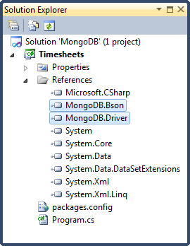

We're now ready to start working with MongoDB.

## Driver in Action

Let's see the driver in action. First we setup a connection.

```csharp
const string connectionstring = "mongodb://localhost/my_first_mongodb_db";
var database = MongoDatabase.Create(connectionstring);
```

Now add a simple class called Person to the project.

```csharp
public class Person
{
    public string FirstName { get; set; }
    public string LastName { get; set; }
}
```

We'll be storing instances of this class in a MongoDB collection. But first we'll need to obtain a MongoCollection instance. Each collection has a name, here we'll use the type name of Person, but you can use any name you like.

```csharp
 var collection = database.GetCollection<Person>(typeof (Person).Name);
```

**Remark**: Notice the generic parameter type Person passed to the GetCollection(...) method. Here we specify that this collection will be working with the Person type.

Let's create a new instance of Person and add it to the MongoDB collection.

```csharp
var person = new Person
{
    FirstName = "Bruce",
    LastName = "Wayne"
};

collection.Insert(person);
```

Compile and run the application. Afterwards open MongoVUE and check out the Database Explorer. You'll notice that a new database called "my_first_mongodb_db" has automatically been created for you.

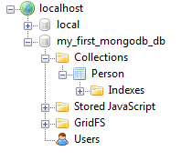

It contains one collection called Person and this collection contains one document which represents the instance we inserted into the collection.

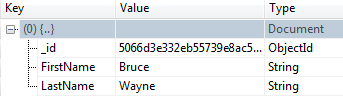

Notice that although our Person class does not contain an Id property MongoDB automatically assigned an \_id (ObjectId) to the newly created document. Almost every MongoDB document has an \_id field as its first attribute. ObjectId is the most common type used for it. \_id must be unique for each document in a collection.

[ObjectId](http://www.mongodb.org/display/DOCS/Object+IDs) is a 12-byte binary value consisting out of:

- 4-byte timestamp (seconds sinds epoch)
- 3-byte machine id
- 2-byte process id
- 3-byte counter

Let's add an Id property of type ObjectId to the Person class type.

```csharp
public class Person
{
    public ObjectId Id { get; set; }
    public string FirstName { get; set; }
    public string LastName { get; set; }
}
```

Copy the value of this \_id in your clipboard. The value of your \_id will of course be different. You can now use this value to retrieve a person from the Person collection.

```csharp
var query = Query.EQ("_id", new ObjectId("5066d3e332eb55739e8ac5a3"));
var person = collection.Find(query).Single();
Console.WriteLine(string.Format("{0} {1} {2}", person.Id, person.FirstName, person.LastName));
```

The output:

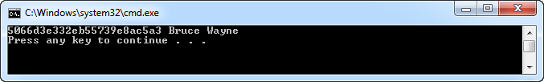

Want to update a person? No problem, just retrieve the person from the collection, modify the necessary properties and save it back to the collection.

```csharp
person.FirstName = "Clark";
person.LastName = "Kent";
collection.Save(person);
```

As a last example let's clean up after ourselves, let's delete the person from the collection.

```csharp
collection.Remove(Query.EQ("_id", new ObjectId("5066d3e332eb55739e8ac5a3")));
```

I hope you enjoyed this quick introduction to MongoDB. Be sure to check it out in more detail. It’s very easy to setup and use, has a great community...etc. Might come in handy when you don't want to go through the hassle of setting up (and paying for an) SQL Server / Oracle database.
